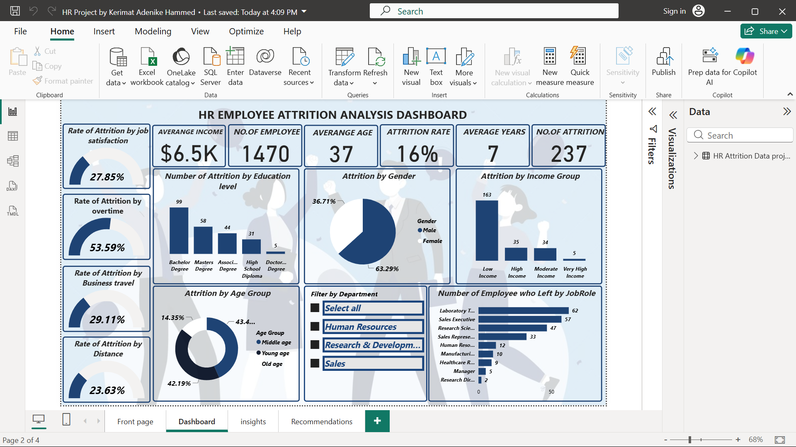

# HR Employment Attrition Analysis

A Power BI dashboard analyzing employee attrition drivers gender, education, income, age group, job role, overtime, business travel, and commute distance using the IBM HR Analytics dataset.

## Goal
Identify which factors are most strongly associated with employees leaving the organization, and translate that into retention recommendations.

## Tools
Power BI (Desktop)

## File
`HR_Attrition_Analysis.pbix` — includes the data model, report pages, and visuals. Open directly in Power BI Desktop (free) to explore interactively.

## Report pages
1. **Front page** — title page
2. **Dashboard** — KPI cards (No. of Employees, Average Income, Average Age, Average Years, No. of Attrition, Attrition Rate) plus:
   - Attrition by Gender
   - Attrition by Income Group
   - Number of Employees who Left by Job Role
   - Rate of Attrition by Job Satisfaction / Overtime / Business Travel / Distance (gauges)
   - Attrition by Age Group
3. **Insights** — written summary of findings
4. **Recommendations** — action items

## Key insights
- Total workforce of **1,470 employees**, with **237 departures** — a **16% attrition rate**.
- **Male employees** account for ~63% of attrition vs. ~37% for female employees.
- Attrition is highest among **Bachelor's degree holders** and lowest among **Doctorate holders**.
- **Low-income earners** have the highest attrition; attrition decreases steadily as income rises.
- **Middle-aged and young employees** contribute the largest share of attrition; older employees have the lowest.
- **Laboratory Technicians, Sales Executives, and Research Scientists** see the highest turnover; **Managers and Research Directors** the lowest.
- **Overtime** is linked to the highest attrition rate (53.59%), along with frequent business travel and longer commutes.

## Recommendations
- Improve work-life balance: reduce excessive overtime, introduce flexible hours.
- Review low-income salaries regularly for fair, competitive compensation.
- Invest in training, mentoring, and promotion paths to support retention.
- Reduce workload pressure and improve employee recognition.
- Limit frequent business travel; provide travel allowances/transport support where needed.
- Run regular employee satisfaction surveys and strengthen manager-staff communication.

## Preview

## Data source
IBM HR Analytics Employee Attrition dataset (public, commonly used for HR analytics practice).
